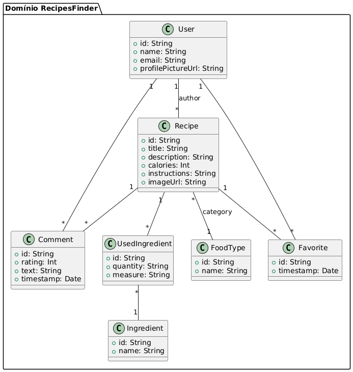

# Documentação do Projeto RecipesFinder

## 1. Diagrama de Classes do Domínio

Este diagrama apresenta as principais entidades envolvidas no sistema, bem como as relações existentes entre elas. Ele serve como guia visual para compreender como os objetos do mundo real (usuários, receitas, ingredientes, etc.) se conectam dentro da aplicação.



**Entidades e Descrições:**

- **User**\
  Representa o usuário da aplicação. Pode ser usuário anônimo (acesso limitado) ou autenticado (cria, edita e exclui receitas). Cada `User` pode criar várias receitas, fazer comentários e favoritar receitas.

- **Recipe**\
  Contém as informações de uma receita: título, descrição, calorias, instruções de preparo e URL de imagem. Cada `Recipe` pertence a uma categoria (`FoodType`), utiliza vários ingredientes (`UsedIngredient`) e recebe comentários e favoritos de usuários.

- **Ingredient**\
  Define um ingrediente base no sistema, contendo um identificador e nome.

- **UsedIngredient**\
  Associa `Recipe` e `Ingredient`, especificando quantidade e unidade de medida de cada ingrediente em uma receita.

- **FoodType**\
  Categoria da receita (por exemplo, Sobremesa, Prato Principal, Entrada), usada para agrupar e filtrar receitas.

- **Comment**\
  Avaliação deixada pelos usuários em cada receita, contendo nota (int), texto do comentário e timestamp.

- **Favorite**\
  Marca uma `Recipe` como favorita por um `User`, incluindo a data em que foi favoritada.

**Relações Principais:**

- Um **User** pode criar várias **Recipe**, **Comment** e **Favorite**.
- Cada **Recipe** pertence a um **FoodType**, utiliza múltiplos **UsedIngredient** (que referenciam **Ingredient**) e recebe **Comment** e **Favorite** de usuários.

---

## 2. Ferramentas Escolhidas

Para garantir produtividade, qualidade e rastreabilidade no desenvolvimento, adotamos:

1. **Git**\
   Sistema de controle de versão distribuído. Permite histórico completo de alterações, branching/merging colaborativo e integração com plataformas como GitLab.

2. **Gradle**\
   Ferramenta de automação de build e gerenciamento de dependências, integrada ao Android Studio. Define tarefas de compilação, geração de APKs, execução de testes e lint.

3. **Room**\
   Biblioteca de persistência local baseada em SQLite. Fornece abstração via DAOs, checagem de tipo em tempo de compilação e migrações automáticas de esquema.

4. **Firebase**\
   Plataforma de backend na nuvem com serviços de Authentication, Firestore e Storage. Inclui emuladores locais para testes e CI.

5. **Navigation Component**\
   Biblioteca Android para definição e controle de navegação entre telas, garantindo back‑stack consistente e animações padronizadas.

---

## 3. Frameworks Reutilizados

O desenvolvimento foi realizado no **Android Studio**, IDE oficial do Google para Android, que oferece:

- Editor avançado com autocompletar Kotlin/Java
- Ferramentas de profiling (CPU, memória, rede)
- Emuladores configuráveis para múltiplos níveis de API
- Integração nativa com Gradle, ADB e SDK Manager

Aproveitamos templates de Activity/Fragment, recursos de refatoração e integração com plugins de qualidade de código.

---

## 4. Geração de Documentação do Código

Para manter a documentação técnica alinhada ao código, usamos **Dokka**, que lê comentários no padrão KDoc (Kotlin) e gera um site estático:

```bash
./gradlew dokkaHtml
```

- A saída HTML fica em:\
  `app/build/dokka/html/index.html`

No site gerado, é possível navegar por pacotes, classes, funções e propriedades, visualizando descrições, parâmetros, exemplos de uso e hierarquias.

---

## 5. Como Executar o Sistema

Para compilar e rodar o aplicativo em um dispositivo ou emulador Android, siga os passos:

1. **Pré-requisitos**

   - Android Studio (Arctic Fox ou superior)
   - Android SDK API 30 ou superior
   - Arquivo `google-services.json` do projeto Firebase copiado para `app/`
   - (Opcional) Emulador local do Firebase via Docker:
     ```bash
     docker-compose up -d
     ```

2. **Clonar o repositório**

   ```bash
   git clone https://github.com/seu-usuario/recipesfinder.git
   cd recipesfinder
   ```

3. **Instalar dependências e gerar build**

   ```bash
   ./gradlew clean assembleDebug
   ```

4. **Instalar e executar**

   - **Pelo Android Studio**: abra o projeto e clique em **Run**, selecionando um AVD ou dispositivo real.
   - **Via linha de comando**:
     ```bash
     adb install -r app/build/outputs/apk/debug/app-debug.apk
     ```

